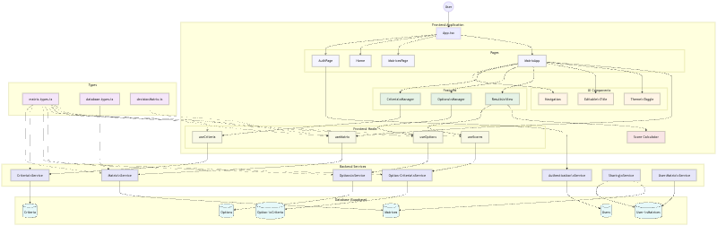

# Application Architecture

The Decision Matrix application follows a modern React frontend with Supabase backend architecture.

## Architecture Overview

## Frontend Architecture

The frontend is organized into the following main areas:

- **Components**: React components organized by feature and function
  - **Features**: Major application features (CriteriaManager, OptionsManager, Results)
  - **Layout**: Structural components (Navigation)
  - **UI**: Reusable UI components (EditableTitle, ThemeToggle)
- **Hooks**: Custom React hooks for state management and logic separation
- **Styles**: Component-specific and global CSS styles
- **Utils**: Frontend utility functions

## Backend Architecture

The backend uses Supabase for data storage, authentication, and API services:

- **Services**: Organized by entity (matrix, criteria, options, etc.)
- **Auth Flow**: Supabase JWT-based authentication
- **Data Flow**: Browser → Frontend → Backend Services → Supabase

## Database Schema

See the [Database Schema](./database-schema.md) document for details on the PostgreSQL schema design.

## Security Model

The application implements row-level security (RLS) through Supabase policies to ensure users can only access their own data or data explicitly shared with them.